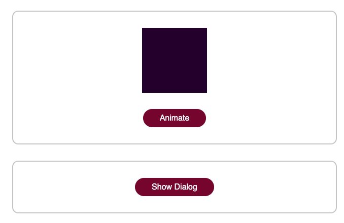

# Practice Vue Transitions and Animations

Practice is from Udemy Course by Maximilian Schwarzmüller. 

## To Start

``npm install``

``npm run serve``

## Features and Functionality
This section is: What did I learn and put into practice.

* CSS Transform and Transition
* Vue: @Click, data set to false, in method set to true
* @keyframes and animation CSS property
* Vue component "Transition". Can only wrap around one child element. Manipulates the element. 

## Progress Shots

Starting File:

Added animation transition to class="block":

